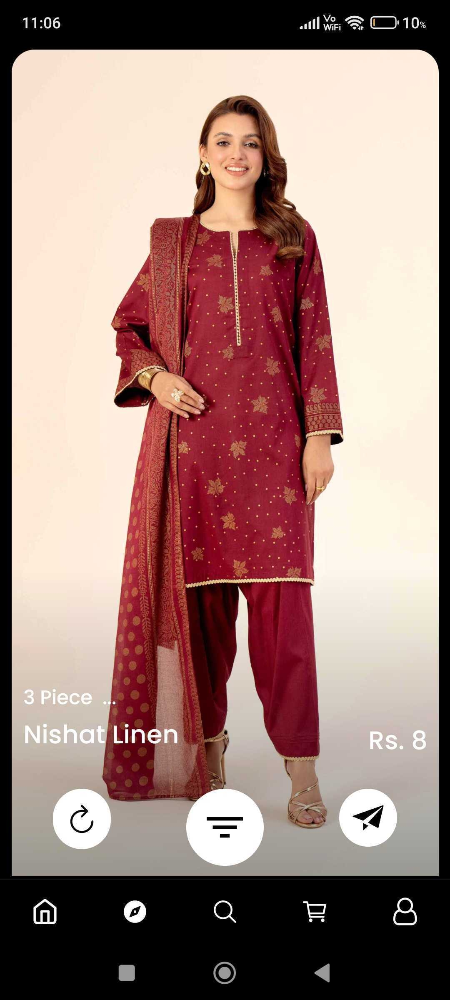
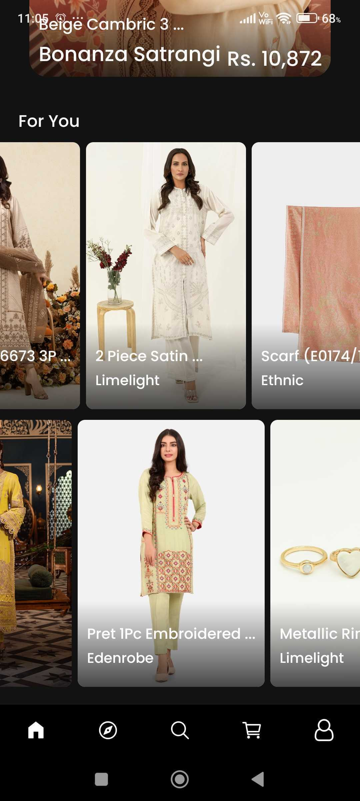
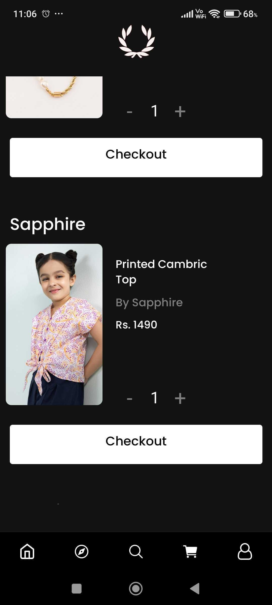

# Juno : Swipe to Shop 
## Hyper personalised women's fashion in pakistan.

In pakistan currently there is NOT A SINGLE app for women
to for fashion online and the alternatives are unresponsive
websites that are designed for desktop and not mobile which 
makes the experience very bad. Personally, my mother and sister
would face this issue every single day when shopping online 
and it was very hard for them to discover new clothes and brands as each brand had a different website. To solve this problem I am making a simple mobile app with all the brands in one place and using a recommendation algorithm and swipe feed they can discover new products and brands very easily.

### Features
* 50+ Brands
* A.I Powered semantic search
* Swipe to shop feed
* Checkout in one place
* Save products for later and share with your friends
* Real time recommendations
* Help me Shop Virtual Assistant
* Messaging forum

### Screenshots

